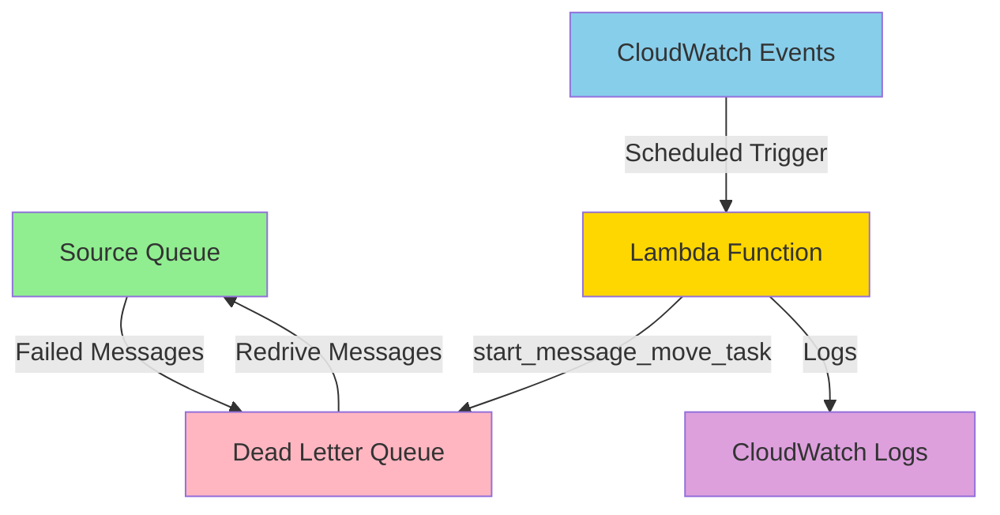

# AWS DLQ Auto-Redrive Lambda

An automated solution for redriving messages from AWS SQS Dead Letter Queues (DLQs) back to their source queues using AWS Lambda.

## 🏆 AWS Hackathon Project

This project demonstrates the use of AWS Lambda to solve a common operational challenge: automatically retrying failed messages in SQS queues.

[AWS LAMBDA HACKATHON ON DEV.POST](https://awslambdahackathon.devpost.com/)

## 🎯 Problem Statement

When messages in SQS queues fail to process after maximum retry attempts, they end up in Dead Letter Queues (DLQs). These messages often need manual intervention to be reprocessed. This solution automates the redrive process, saving time and reducing operational overhead.

## 🚀 Solution Overview

This Lambda function automatically:
- Scans configured DLQs on a scheduled basis (twice daily)
- Initiates message move tasks to return messages to their source queues
- Logs all operations for monitoring and debugging
- Handles multiple DLQs in a single execution

## 🏗️ Architecture



## 📋 Features

- **Automated Scheduling**: Runs twice daily via CloudWatch Events (cron expression)
- **Multi-DLQ Support**: Process multiple DLQs in a single Lambda execution
- **Error Handling**: Graceful error handling with detailed logging
- **ARM64 Architecture**: Cost-optimized using Graviton2 processors
- **Minimal Permissions**: Follows AWS security best practices with least privilege

## 🛠️ Technical Details

### Lambda Configuration
- **Runtime**: Python 3.12
- **Architecture**: ARM64 (Graviton2)
- **Memory**: 128 MB
- **Timeout**: 60 seconds
- **Schedule**: `cron(0 0,12 * * ? *)` (Midnight and Noon UTC daily)

### Environment Variables

#### DLQ_ARNS Configuration

The `DLQ_ARNS` environment variable must be configured with a comma-separated list of Dead Letter Queue ARNs that you want to redrive. 

**Format:**
```
arn:aws:sqs:region:account-id:queue-name1,arn:aws:sqs:region:account-id:queue-name2
```

**Example:**
```yaml
DLQ_ARNS: "arn:aws:sqs:us-east-1:123456789012:MyApp-DLQ,arn:aws:sqs:us-east-1:123456789012:OrderProcessing-DLQ,arn:aws:sqs:us-east-1:123456789012:EmailService-DLQ"
```

**Important:** 
- Each DLQ must have a configured source queue for the redrive to work
- The Lambda function needs permissions to access all listed DLQs
- ARNs should be separated by commas with no spaces

### Required Permissions
- `sqs:StartMessageMoveTask` - To initiate the redrive process
- `sqs:GetQueueAttributes` - To read queue metadata
- `logs:CreateLogGroup`, `logs:CreateLogStream`, `logs:PutLogEvents` - For CloudWatch logging

## 📦 Deployment

1. **Prerequisites**
   - AWS CLI configured with appropriate credentials
   - SAM CLI installed
   - Python 3.12

2. **Update Configuration**
   - Edit `template.yml` and replace the example DLQ ARNs in the environment variables
   - Update the account IDs and region as needed

3. **Deploy**
   ```bash
   sam build
   sam deploy --guided
   ```

## 📊 Monitoring

The Lambda function provides detailed logging through CloudWatch Logs:
- Task initiation for each DLQ
- Task IDs for tracking
- Error messages for failed operations

## 🔍 How It Works

1. **Trigger**: CloudWatch Events triggers the Lambda function twice daily
2. **Read Configuration**: Lambda reads DLQ ARNs from environment variables
3. **Start Redrive**: For each DLQ, the function calls `start_message_move_task`
4. **Async Processing**: AWS handles the actual message movement asynchronously
5. **Logging**: All operations are logged to CloudWatch

## 💡 Use Cases

- **E-commerce**: Retry failed order processing messages
- **Data Pipeline**: Reprocess failed data transformation jobs
- **Notifications**: Retry failed email/SMS notifications
- **Integration**: Retry failed API calls to external services

## 🚨 Important Notes

- The `start_message_move_task` API moves ALL messages from the DLQ
- Messages maintain their original attributes and message IDs
- The redrive process is asynchronous - the Lambda initiates but doesn't wait for completion
- Each DLQ can only have one active message move task at a time

## 📄 License

This project is created for the AWS Hackathon and is provided as-is for educational and demonstration purposes.
